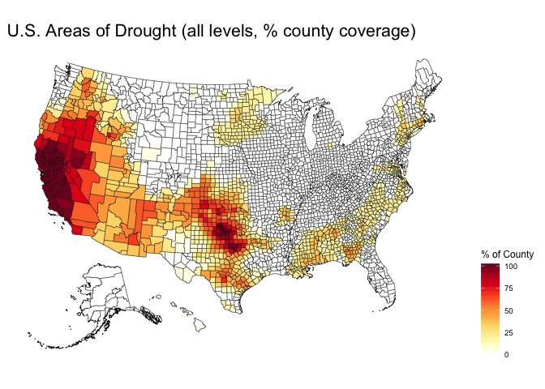
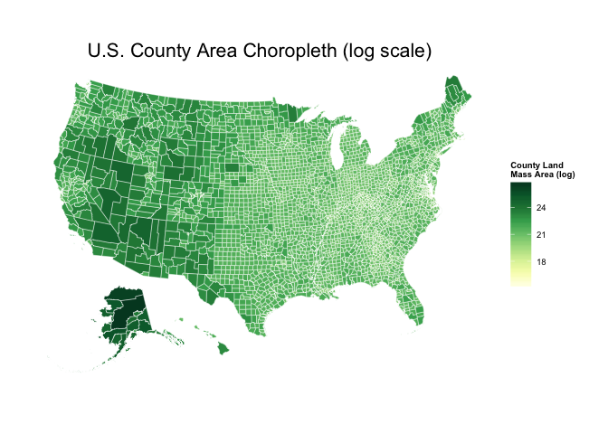

U.S. Full-country county maps in R with a modified Albers projection.

``` r
library(maptools)
library(mapproj)
library(rgeos)
library(rgdal)
library(RColorBrewer)
library(ggplot2)

# for theme_map
devtools::source_gist("33baa3a79c5cfef0f6df")

# https://www.census.gov/geo/maps-data/data/cbf/cbf_counties.html
# read U.S. counties moderately-simplified GeoJSON file
us <- readOGR(dsn="data/us.geojson", layer="OGRGeoJSON")
```

    ## OGR data source with driver: GeoJSON 
    ## Source: "data/us.geojson", layer: "OGRGeoJSON"
    ## with 3221 features and 9 fields
    ## Feature type: wkbPolygon with 2 dimensions

``` r
# convert it to Albers equal area
us_aea <- spTransform(us, CRS("+proj=laea +lat_0=45 +lon_0=-100 +x_0=0 +y_0=0 +a=6370997 +b=6370997 +units=m +no_defs"))
us_aea@data$id <- rownames(us_aea@data)

# extract, then rotate, shrink & move alaska (and reset projection)
# need to use state IDs via # https://www.census.gov/geo/reference/ansi_statetables.html
alaska <- us_aea[us_aea$STATEFP=="02",]
alaska <- elide(alaska, rotate=-50)
alaska <- elide(alaska, scale=max(apply(bbox(alaska), 1, diff)) / 2.3)
alaska <- elide(alaska, shift=c(-2100000, -2500000))
proj4string(alaska) <- proj4string(us_aea)

# extract, then rotate & shift hawaii
hawaii <- us_aea[us_aea$STATEFP=="15",]
hawaii <- elide(hawaii, rotate=-35)
hawaii <- elide(hawaii, shift=c(5400000, -1400000))
proj4string(hawaii) <- proj4string(us_aea)

# remove old states and put new ones back in; note the different order
# we're also removing puerto rico in this example but you can move it
# between texas and florida via similar methods to the ones we just used
us_aea <- us_aea[!us_aea$STATEFP %in% c("02", "15", "72"),]
us_aea <- rbind(us_aea, alaska, hawaii)

# get some data to show...perhaps drought data via:
# http://droughtmonitor.unl.edu/MapsAndData/GISData.aspx
droughts <- read.csv("data/dm_export_county_20141111.csv")
droughts$id <- sprintf("%05d", as.numeric(as.character(droughts$FIPS)))
droughts$total <- with(droughts, (D0+D1+D2+D3+D4)/5)

# get ready for ggplotting it... this takes a cpl seconds
map <- fortify(us_aea, region="GEOID")
```

``` r
# plot it
gg <- ggplot()
gg <- gg + geom_map(data=map, map=map,
                    aes(x=long, y=lat, map_id=id, group=group),
                    fill="#ffffff", color="#0e0e0e", size=0.15)
gg <- gg + geom_map(data=droughts, map=map, aes(map_id=id, fill=total),
                    color="#0e0e0e", size=0.15)
gg <- gg + scale_fill_gradientn(colours=c("#ffffff", brewer.pal(n=9, name="YlOrRd")),
                                na.value="#ffffff", name="% of County")
gg <- gg + labs(title="U.S. Areas of Drought (all levels, % county coverage)")
gg <- gg + coord_equal()
gg <- gg + theme_map()
gg <- gg + theme(legend.position="right")
gg <- gg + theme(plot.title=element_text(size=16))
gg
```



``` r
# area choropleth
gg <- ggplot()
gg <- gg + geom_map(data=map, map=map,
                    aes(x=long, y=lat, map_id=id, group=group),
                    fill="white", color="white", size=0.15)
gg <- gg + geom_map(data=us_aea@data, map=map, aes(map_id=GEOID, fill=log(ALAND)),
                    color="white", size=0.15)
gg <- gg + scale_fill_gradientn(colours=c(brewer.pal(n=9, name="YlGn")),
                                na.value="#ffffff", name="County Land\nMass Area (log)")
gg <- gg + labs(title="U.S. County Area Choropleth (log scale)")
gg <- gg + coord_equal()
gg <- gg + theme_map()
gg <- gg + theme(legend.position="right")
gg <- gg + theme(plot.title=element_text(size=16))
gg
```


